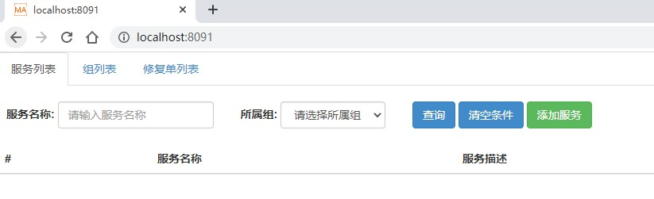
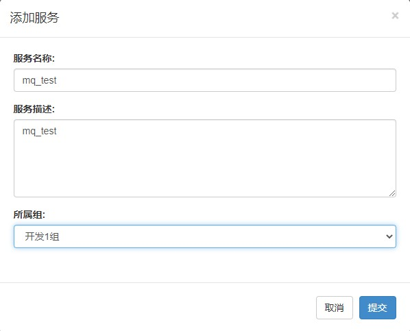
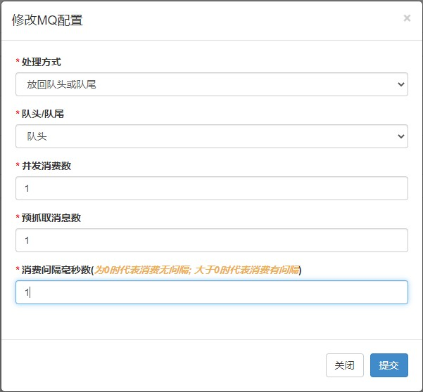
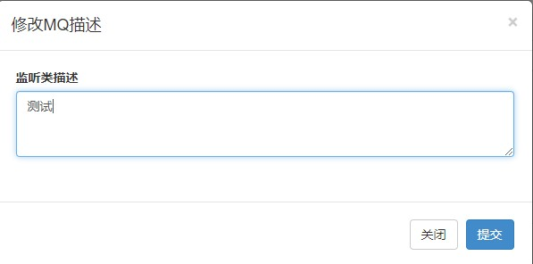
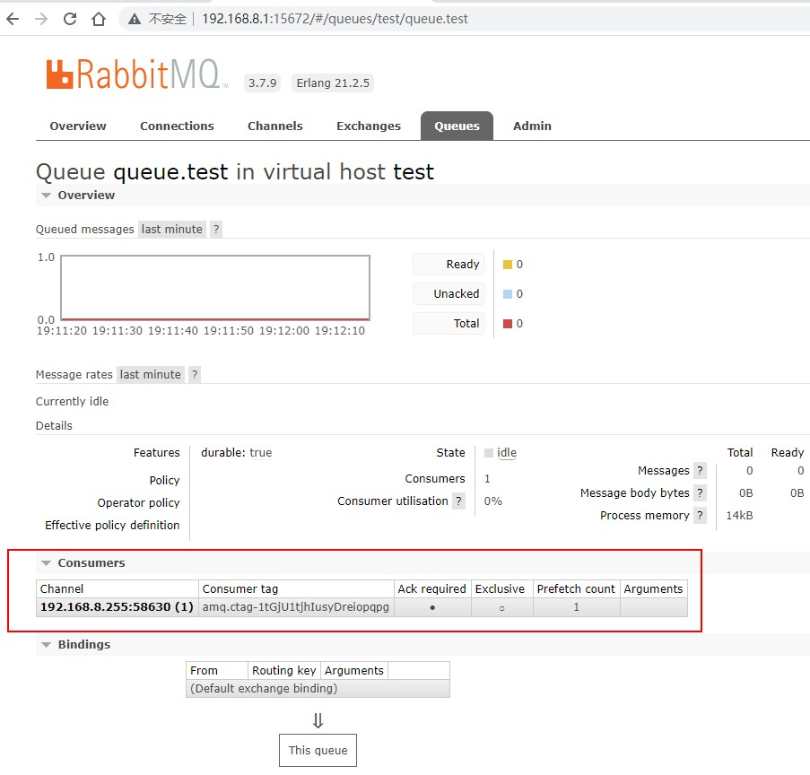
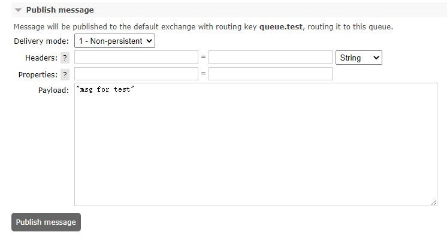
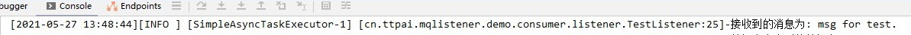

# 快速开始

## 1 运行组件及初始化配置
- 本节中有组件如果已部署好, 请跳过 
- 为了快速演示，组件都是基于docker安装的，生产环境不建议使用该方式
- 这里docker宿主机ip为192.168.8.1
### 1.1 MySQL
- 运行
```
docker pull mysql:5.6.32
docker run --name mysql --restart always -e MYSQL_ROOT_PASSWORD=123456 -p 3306:3306 -d mysql:5.6.32
```
- 配置
```
-- 创建消息队列库
CREATE DATABASE ttpai_mq;

-- MQ服务信息
CREATE TABLE MQ_SERVICE_INFO (
    ID BIGINT(20) NOT NULL AUTO_INCREMENT COMMENT '无意义主键',
    SERVICE_NAME VARCHAR(120) NOT NULL DEFAULT '' COMMENT '服务名',
    SERVICE_DESC VARCHAR(512) NOT NULL DEFAULT '' COMMENT '服务描述',
    GROUP_ID BIGINT(20) NOT NULL DEFAULT -1 COMMENT '组ID(MQ_SERVICE_GROUP表主键ID)',
    GROUP_NAME VARCHAR(20) NOT NULL DEFAULT '' COMMENT '组名',
    DELETED TINYINT(4) NOT NULL DEFAULT 0 COMMENT '是否删除了: 0-未删除, 1-删除',
    CREATE_TIME DATETIME NOT NULL DEFAULT CURRENT_TIMESTAMP COMMENT '创建时间',
    MODIFY_TIME DATETIME NOT NULL DEFAULT CURRENT_TIMESTAMP ON UPDATE CURRENT_TIMESTAMP COMMENT '修改时间',
    PRIMARY KEY (ID),
    UNIQUE KEY UNIQ_SERVICE_NAME (SERVICE_NAME) USING BTREE COMMENT '服务名唯一索引'
) ENGINE=INNODB AUTO_INCREMENT=1 DEFAULT CHARSET=UTF8 COMMENT 'MQ服务信息';

-- MQ服务组信息
CREATE TABLE MQ_SERVICE_GROUP (
    ID BIGINT(20) NOT NULL AUTO_INCREMENT COMMENT '组ID',
    GROUP_NAME VARCHAR(20) NOT NULL COMMENT '组名',
    GROUP_DESC VARCHAR(512) NOT NULL DEFAULT '' COMMENT '组描述',
    DELETED TINYINT(4) NOT NULL DEFAULT 0 COMMENT '是否删除了: 0-未删除, 1-删除',
    CREATE_TIME DATETIME NOT NULL DEFAULT CURRENT_TIMESTAMP COMMENT '创建时间',
    MODIFY_TIME DATETIME NOT NULL DEFAULT CURRENT_TIMESTAMP ON UPDATE CURRENT_TIMESTAMP COMMENT '修改时间',
    PRIMARY KEY (ID),
    UNIQUE KEY UNIQ_GROUP_NAME (GROUP_NAME) USING BTREE COMMENT '组名唯一索引'
) ENGINE=INNODB AUTO_INCREMENT=1 DEFAULT CHARSET=UTF8 COMMENT 'MQ服务组信息';

-- MQ基础配置表
CREATE TABLE MQ_BASE_CONFIG (
    ID BIGINT(20) NOT NULL AUTO_INCREMENT COMMENT '无意义主键id',
    CONFIG_TYPE INT(11) NOT NULL COMMENT '配置类型',
    PARAM_NAME VARCHAR(30) NOT NULL COMMENT '参数名',
    PARAM_VALUE VARCHAR(120) NOT NULL COMMENT '参数值',
    CREATE_TIME DATETIME NOT NULL DEFAULT CURRENT_TIMESTAMP COMMENT '创建时间',
    MODIFY_TIME DATETIME NOT NULL DEFAULT CURRENT_TIMESTAMP ON UPDATE CURRENT_TIMESTAMP COMMENT '修改时间',
    PRIMARY KEY (ID)
) ENGINE=INNODB AUTO_INCREMENT=1 DEFAULT CHARSET=UTF8 COMMENT 'MQ基础配置表';

-- MQ基础配置数据初始化
INSERT INTO MQ_BASE_CONFIG(CONFIG_TYPE, PARAM_NAME, PARAM_VALUE) VALUES (100, 'syncOpen', '0');

CREATE TABLE MQ_FIX (
	ID BIGINT(20) NOT NULL AUTO_INCREMENT COMMENT '无意义主键ID',
	FIX_NAME VARCHAR(128) NOT NULL DEFAULT '' COMMENT '修复名称',
	CHARGE_PERSON VARCHAR(20) NOT NULL DEFAULT '' COMMENT '负责人',
	FIX_STATUS TINYINT(4) NOT NULL DEFAULT 0 COMMENT '修复状态: 0-修复中, 1-修复结束',
	FIX_REMARK VARCHAR(128) NOT NULL DEFAULT '' COMMENT '修复备注',
	CREATE_TIME DATETIME NOT NULL DEFAULT CURRENT_TIMESTAMP COMMENT '创建时间',
	MODIFY_TIME DATETIME NOT NULL DEFAULT CURRENT_TIMESTAMP ON UPDATE CURRENT_TIMESTAMP COMMENT '更新时间',
	PRIMARY KEY (ID)
) ENGINE=INNODB AUTO_INCREMENT=1 DEFAULT CHARSET=UTF8 COMMENT '修复表';

CREATE TABLE MQ_FIX_MSG (
	ID BIGINT(20) NOT NULL AUTO_INCREMENT COMMENT '无意义主键ID',
	FIX_ID BIGINT(20) NOT NULL COMMENT '修复ID',
	MSG_TEXT_ID BIGINT(20) NOT NULL COMMENT '消息文本ID',
	ORDER_NUM INT(11) NOT NULL COMMENT '排序数字',
	FIX_MSG_STATUS TINYINT(4) NOT NULL DEFAULT 0 COMMENT '修复状态: 0-待修复, 1-修复中, 2-修复成功, 3-修复异常',
	FIX_REMARK VARCHAR(128) NOT NULL DEFAULT '' COMMENT '修复备注',
	DELETED TINYINT(4) NOT NULL DEFAULT 0 COMMENT '是否删除了: 0-未删除, 1-已删除',
	CREATE_TIME DATETIME NOT NULL DEFAULT CURRENT_TIMESTAMP COMMENT '创建时间',
	MODIFY_TIME DATETIME NOT NULL DEFAULT CURRENT_TIMESTAMP ON UPDATE CURRENT_TIMESTAMP COMMENT '更新时间',
	PRIMARY KEY (ID)
) ENGINE=INNODB AUTO_INCREMENT=1 DEFAULT CHARSET=UTF8 COMMENT '修复消息表';

CREATE TABLE MQ_FIX_MSG_TEXT (
	ID BIGINT(20) NOT NULL AUTO_INCREMENT COMMENT '无意义主键ID',
	MSG_TEXT VARCHAR(5000) NOT NULL DEFAULT '' COMMENT '消息文本',
	CREATE_TIME DATETIME NOT NULL DEFAULT CURRENT_TIMESTAMP COMMENT '创建时间',
	MODIFY_TIME DATETIME NOT NULL DEFAULT CURRENT_TIMESTAMP ON UPDATE CURRENT_TIMESTAMP COMMENT '更新时间',
	PRIMARY KEY (ID)
) ENGINE=INNODB AUTO_INCREMENT=1 DEFAULT CHARSET=UTF8 COMMENT '修复消息表对应消息文本表';
```
### 1.2 RabbitMQ
- 运行
```
docker pull rabbitmq:3.7.9-management
docker run -d --hostname rabbitmq_node_1 --name rabbitmq_1 --restart always -e RABBITMQ_DEFAULT_USER=admin -e RABBITMQ_DEFAULT_PASS=123456 -p 5672:5672 -p 15672:15672 rabbitmq:3.7.9-management
```
- 配置
```
新建virtual host：test
新建queue：queue.test
```
### 1.3 Zookeeper
```
docker pull zookeeper:3.4.9
docker run --name zookeeper --restart always -d -p 2181:2181 zookeeper:3.4.9
```

## 2 部署listener服务
### 2.1 pom.xml中添加依赖
```
<dependency>
   <groupId>cn.ttpai.framework</groupId>
   <artifactId>ttpai-mqlistener-spring</artifactId>
   <version>打包的版本</version>
</dependency>
```
### 2.2 applicationContext.xml需引入的xml文件
- 若只是使用app mq, 则引入`<import resource="classpath*:mq_app_server.xml"/>`
- 若只是使用soa mq, 则引入`<import resource="classpath*:mq_soa_server.xml"/>`
- 若两者都需使用，则引入`<import resource="classpath*:mq_all_server.xml"/>`

> 注意：这里的app mq、soa mq是部署的两个rabbitmq集群
### 2.3 mqlistener.properties文件
```
## 基本配置
# 服务名称
project.name=mq_test
# 异常接收者邮箱
email.to.for.listener.exception=xxxxx@xxx.xx
# 环境code: 0-开发、1-测试、2-模拟、3-正式
env.code=0

## zookeeper配置
# zk重试参数
zoo.baseSleepTimeMs=1000
zoo.maxRetries=3
# zk地址
zoo.address=192.168.8.1:2181
# zk数据根路径
zoo.root.path=/ttpai_mq_listener

## 告警邮箱账号
listener.email.client.host=smtp.exmail.qq.com
listener.email.client.port=465
listener.email.client.username=xxxxx@xxx.xx
listener.email.client.password=123456
listener.email.client.usessl=true
listener.email.client.from=xxxxx@xxx.xx
listener.email.client.charset=UTF-8

## app mq配置
rabbitmq.app.host=192.168.8.1
rabbitmq.app.port=5672
rabbitmq.app.username=admin
rabbitmq.app.password=123456

## soa mq配置
rabbitmq.soa.host=192.168.8.1
rabbitmq.soa.port=5672
rabbitmq.soa.username=admin
rabbitmq.soa.password=123456
```
### 2.4 listener配置
- 继承AbstractListener
```
package cn.ttpai.mqlistener.demo.consumer.listener;

import cn.ttpai.mqlistener.spring.AbstractListener;

/**
 * testListener
 * 
 * @author jiayuan.su
 */
public class TestListener extends AbstractListener<String> {
    private static final Logger logger = LoggerFactory.getLogger(TestListener.class);

    @Override
    public void listener(String msg) throws Exception {
        logger.info("接收到的消息为: {}.", msg);
    }
}
```
- 在applicationContext.xml中添加如下配置
```
<!-- 连接工厂 -->
<rabbit:connection-factory id="demoConnectionFactory"
                           virtual-host="${rabbitmq.vhost.test}"
                           connection-factory="abstractConnectionFactory4App"/>

<!-- 定义 消费者示例 -->
<bean id="testListener" class="cn.ttpai.mqlistener.demo.consumer.listener.TestListener">
    <property name="connectionFactory" ref="demoConnectionFactory"/>
    <property name="queue" value="${rabbitmq.queue.test}"/>
</bean>
```
### 2.5 服务启动
- 使用自己项目原本启动方式启动
- 为了在开发时快速测试，可使用ttpai-mqlistener-spring-demo-consumer示例中的MqApplication方式启动

## 3 部署mqlistener admin
### 3.1 打包mqlistener admin对应war包
```
mvn clean package
```
### 3.2 启动
将war包放入web容器(比如tomcat、resin)中即可启动。

### 3.3 配置说明
#### 3.3.1 common.properties
```
# 第1个rabbit集群的ip
rabbit.app.admin.ip = 192.168.8.1
# 第1个rabbit集群的端口号
rabbit.app.admin.port = 15672
# 第1个rabbit集群的用户名
rabbit.app.admin.username = admin
# 第1个rabbit集群的密码
rabbit.app.admin.password = 123456

# 第2个rabbit集群的ip
rabbit.soa.admin.ip = 192.168.8.1
# 第2个rabbit集群的端口号
rabbit.soa.admin.port = 15672
# 第2个rabbit集群的用户名
rabbit.soa.admin.username = admin
# 第2个rabbit集群的密码
rabbit.soa.admin.password = 123456
```
#### 3.3.2 graylog.properties
```
# 日志是否打印到控制台: 线下配置为 ALL，线上可以配置为 OFF，全部输出到 Graylog
stdout.filter.level = all
cn.ttpai.mqlistener.level = info
```
> 日志记录也可换成自己想要使用的方式，比如log4j
#### 3.3.3 jdbc.properties
```
jdbc.druid.filters=stat,log4j,wall
jdbc.driverClassName=com.mysql.jdbc.Driver
jdbc.initialSize=5
jdbc.maxActive=10
jdbc.minIdle=5
jdbc.maxWait=60000
jdbc.timeBetweenEvictionRunsMillis=60000
jdbc.minEvictableIdleTimeMillis=300000

# 库的地址
mq.jdbc.url=jdbc:mysql://192.168.8.1:3306/ttpai_mq?useUnicode=true&characterEncoding=utf8&zeroDateTimeBehavior=convertToNull
# 用户名
mq.jdbc.username=root
# 密码
mq.jdbc.password=123456
```
#### 3.3.4 zoo.properties
```
# zookeeper的地址
zoo.address=192.168.8.1:2181
# zookeeper客户端参数
zoo.baseSleepTimeMs=1000
# zookeeper客户端参数
zoo.maxRetries=3

# 数据存放根目录
zoo.root.path=/ttpai_mq_listener
```

### 3.4 界面操作

启动后可以看到如下界面



管理`listener`服务的`TestListener`监听器，步骤如下

- 添加组

  在组列表选项卡中，添加组，比如：开发1组

- 添加服务

  在服务列表选项卡中，添加服务，这里是前面部署的listener服务

  

  > 服务名称是前面部署的listener服务的mq-spring.properties文件中的project.name属性对应的值

- 配置listener

  * 点击服务列表中项的查看详情

  * 继续点击查看详情

  * 点击修改配置(这里用如下配置做演示)

    

  * 修改描述

    

  * 修改管理员

    

  * 继续点击查看详情

  * 点击启用，可以在RabbitMQ Management中看到队列消费者

    


## 3.5 测试效果

- 在RabbitMQ Management界面中发送消息

  

- 在listener服务的控制台上会看到消息消费了

  

---

其他文档入口
- [0 项目简介](./0%20项目简介.md)
- [2 功能详细介绍](./2%20功能详细介绍.md)
- [3 架构设计介绍](./3%20架构设计介绍.md)