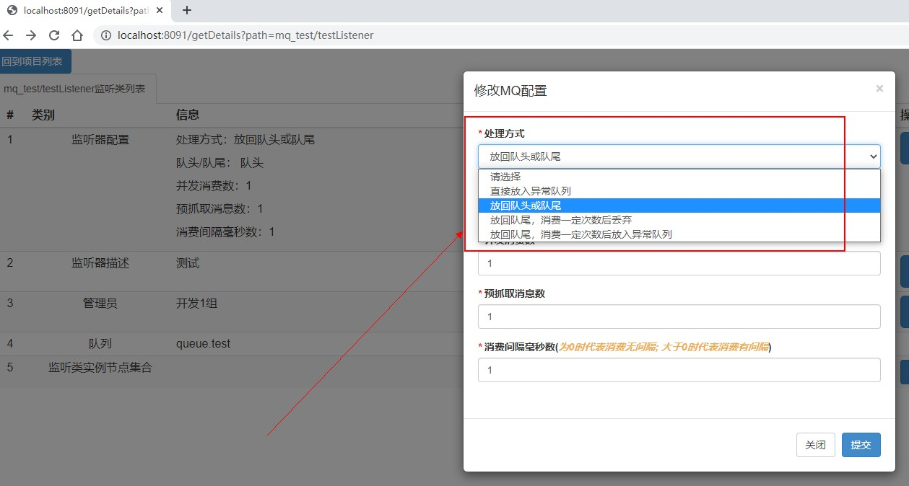
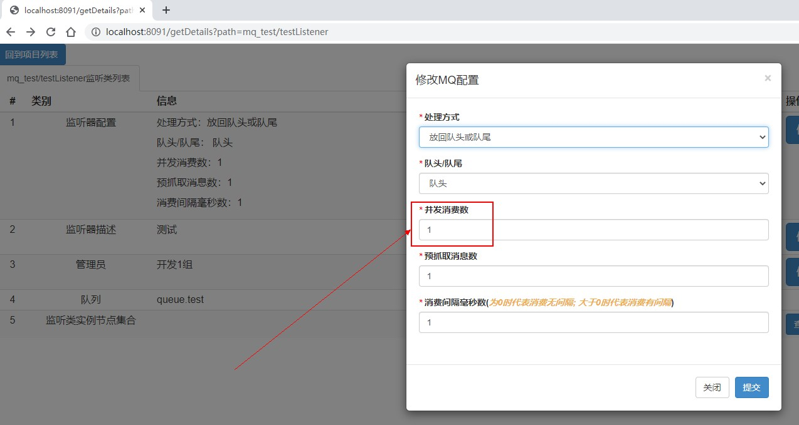
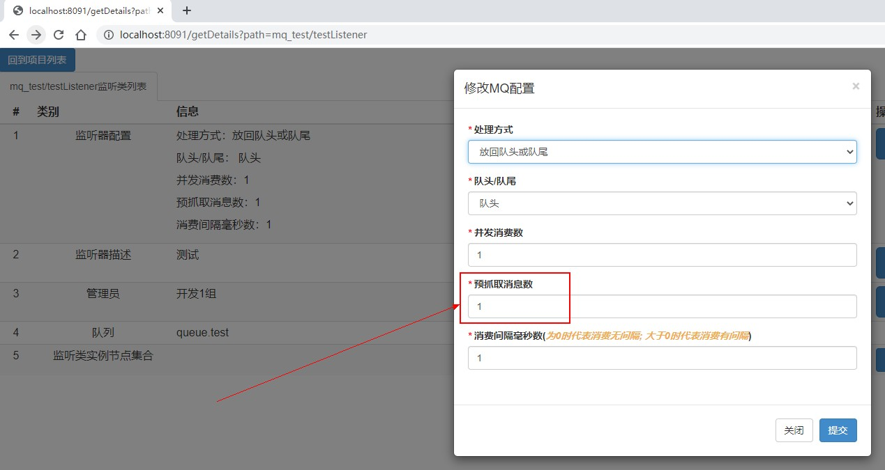
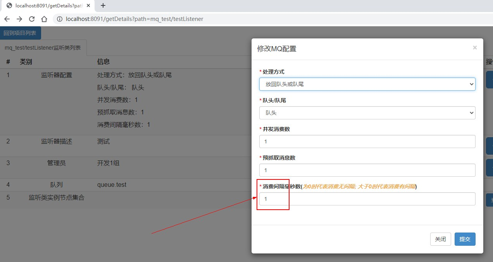
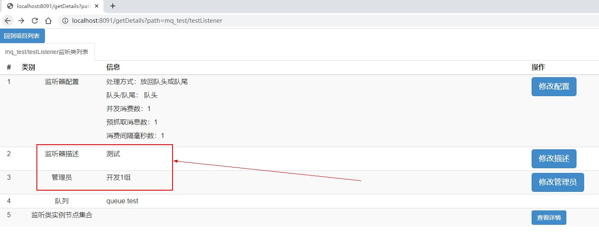
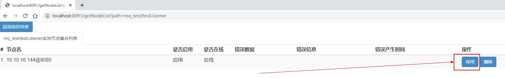
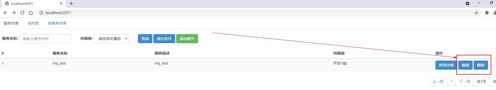
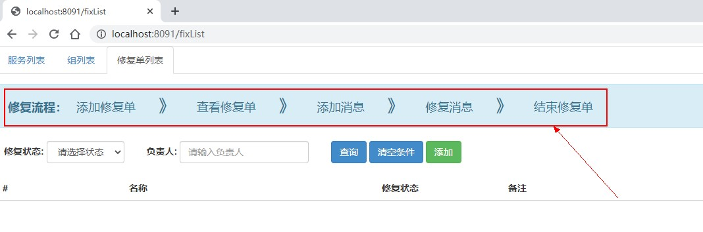

# 功能详细介绍
## 1 处理消费失败消息
消息消费者在消费消息时，在某些情况下，比如调用下级服务超时、代码问题等，会发生消息消费失败的情况。这时，就需要对消费失败的消息进行相应的处理。
### 1.1 四种处理方式
- 直接放入异常队列<br/>
  需在RabbitMQ Management中建立一个异常队列(比如在快速开始文档中, 为queue.test队列建立queue.test.fail异常队列)，用于专门存放消费失败的消息
- 放回队头或队尾<br/>
  消息消费失败时, 可有选择地丢回队头或队尾进行重新消费
- 放回队尾，消费一定次数后丢弃<br/>
  消息消费失败时, 在未达到指定的消费失败次数时, 继续丢回队尾进行重新消费; 在达到指定的消费失败次数时, 丢弃消息
- 放回队尾，消费一定次数后放入异常队列<br/>
  消息消费失败时, 在未达到指定的消费失败次数时, 继续丢回队尾进行重新消费; 在达到指定的消费失败次数时, 把消息丢进异常队列
  
> 其实还有一种隐含的处理方式, 即消息消费者在代码中把异常catch了, 自己进行了处理, 这时管理端的处理方式就失效了
> ```
> public class TestListener extends AbstractListener<String> {
>    private static final Logger logger = LoggerFactory.getLogger(TestListener.class);
>
>    @Autowired
>    private TestService testService;
>
>    @Override
>    public void listener(String msg) throws Exception {
>        try {
>
>        } catch (Exception e) {
>            logger.error("消息消费失败. 消息体: {}.异常详情: ", msg, e);
>        }
>    }
>}
> ```
### 1.2 如何设置
通过mqlistener admin管理端进行设置


## 2 调整并发消费数
消息消费者在处理某个队列中的消息时, 可以利用多线程同时处理多个消息。
### 2.1 如何设置
通过mqlistener admin管理端进行设置


## 3 调整预抓取消息数
消息消费者可以自行决定每次从消息队列中取消息的数量, 这样可以极大地提高通信效率。
### 3.1 如何设置
通过mqlistener admin管理端进行设置


## 4 调整消息消费间隔时间
消息消费者可以自行决定消费完一条消息后, 多久继续去消费下一条消息。
### 4.1 如何设置
通过mqlistener admin管理端进行设置


## 5 明确消费者用途及责任人
可以通过明确消费者用途及责任人后, 在消费者出现异常时, 很快地知道此消费者功能及责任人
### 5.1 如何设置
通过mqlistener admin管理端进行设置


## 6 实时开启/暂停消费者
- 有时, 消费者依赖下级服务接口, 而下级服务接口在某个时间段需要进行维护. 这时, 我们可以在维护前暂停消费者, 在维护完成后开启消费者;
- 又或者, 消息出现无法ack时, 我们可以暂停消费者, 然后在RabbitMQ Management中查看消息体, 找出无法消费的原因。
### 6.1 如何设置
通过mqlistener admin管理端进行设置


## 7 编辑或删除
- 需要编辑某个listeneer服务的信息时, 可以通过编辑进行修改
- 在某个listener服务下线、某个listener下线或某个节点不再使用时, 我们可以通过删除按钮进行删除
### 7.1 如何设置
通过mqlistener admin管理端进行设置


## 8 修复消息
在消息消费者出现大量消息消费失败，并且丢到异常队列后, 我们在修复了代码问题之后, 需要把异常队列中的消息丢回原始队列重新消费。这时, 我们就可以通过此功能简化操作，极大地提高了处理效率。
### 8.1 如何设置
通过mqlistener admin管理端进行设置, 设置步骤有五步


---

其他文档入口
- [0 项目简介](./../README.md)
- [1 快速开始](./1%20快速开始.md)
- [3 架构设计介绍](./3%20架构设计介绍.md)
