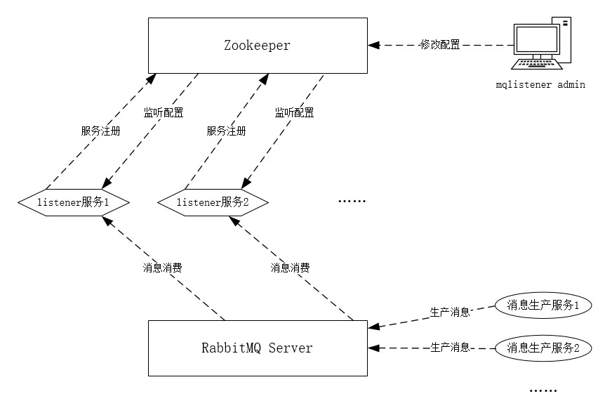

# 架构设计介绍
整体架构图如下： 

- listener服务启动时, 向Zookeeper中注册服务
- listener服务启动后, 会监听自身在Zookeeper中注册的服务的配置信息
- mqlistener admin管理端, 可以对所有listener服务进行配置管理、服务启停等等
- 当mqlistener admin开启某个listener服务时, 相应listener服务就开始消费消息生产服务往RabbitMQ Server中发送的消息了

> 当mqlistener admin修改了某个服务的配置, 相应服务监听到配置变更, 就会近实时地更新自身listener的配置(是在服务运行时变更的, 也就是说无需重启服务就生效了)

---

其他文档入口
- [0 项目简介](./0%20项目简介.md)
- [1 快速开始](./1%20快速开始.md)
- [2 功能详细介绍](./2%20功能详细介绍.md)